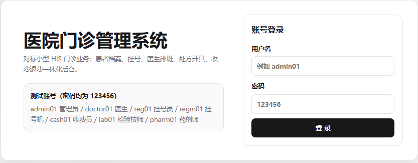
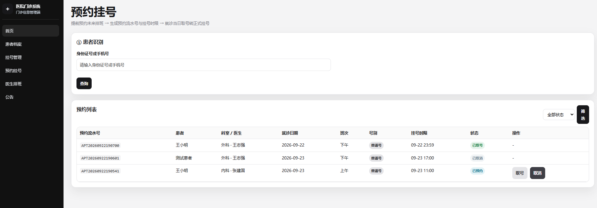
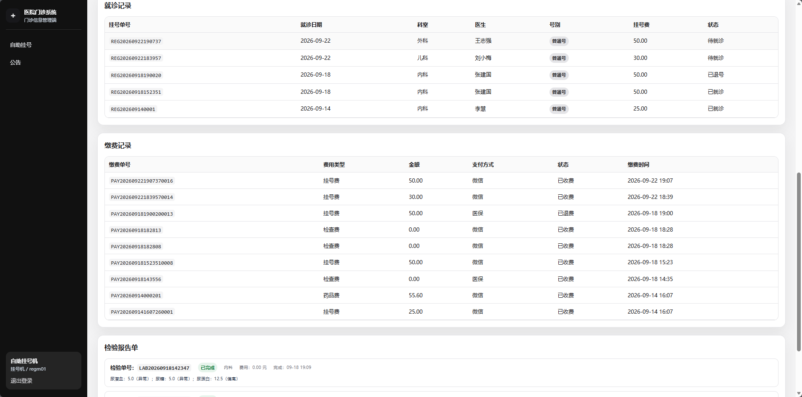
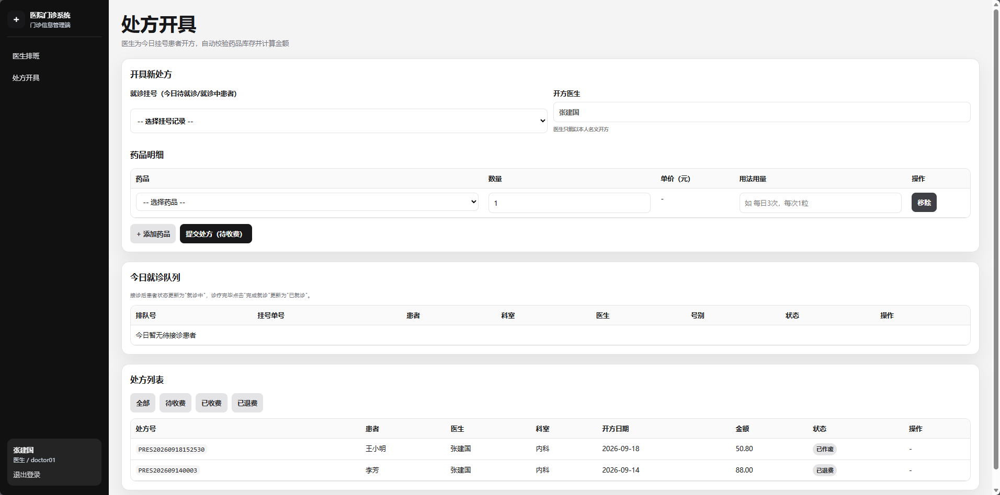
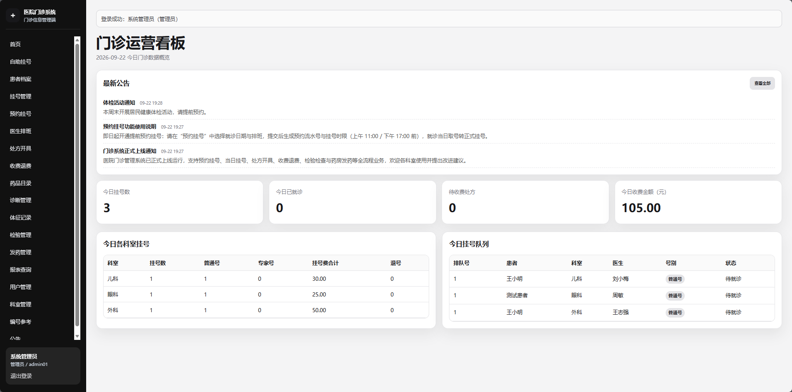
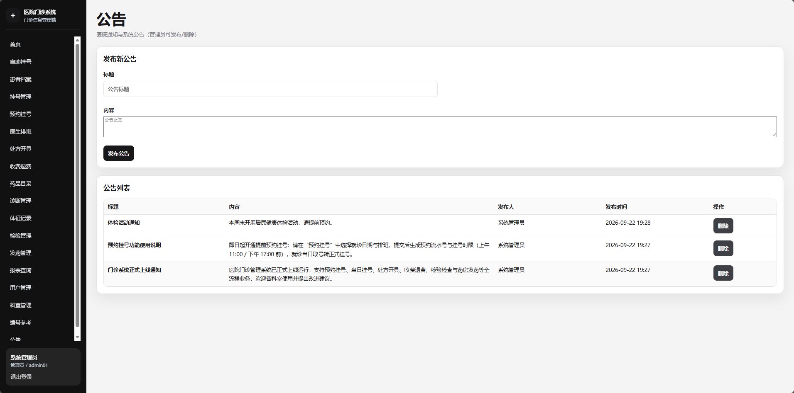
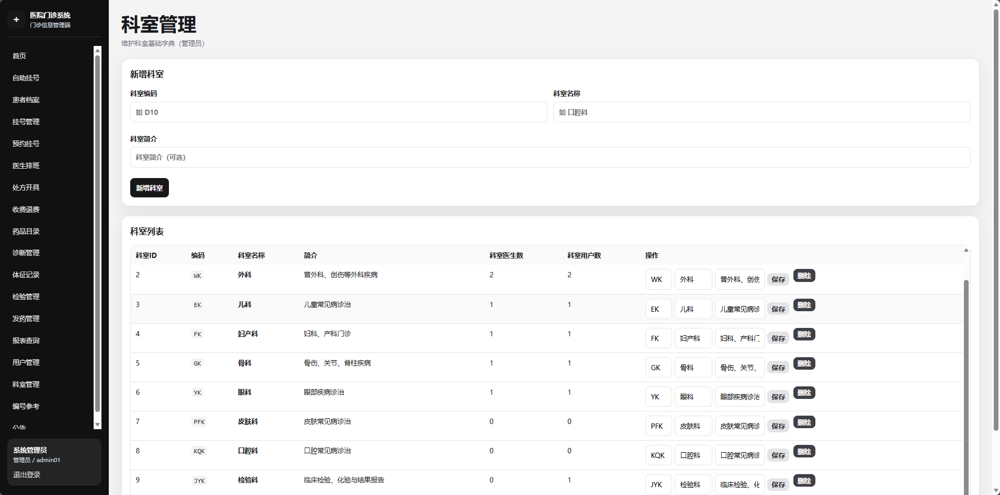

# 医院门诊管理系统（Hospital Outpatient System）

对标小型 HIS 门诊业务的医院门诊管理系统 Web 后台，课程设计项目。

**功能模块**：患者档案、当日挂号、预约挂号（提前预约/取号/取消）、医生排班、处方开具、医生接诊/完成就诊、药房发药、收费退费、检验计费、检验结果录入与汇总、体征记录、诊断管理、用户管理、科室管理、公告管理、患者自助查询（就诊记录/缴费记录/检验报告单）、报表查询。

**技术栈**：Python Flask + MySQL 8.4 + 黑盒测试（禅道用例）+ XMind 需求设计

## 功能总览

| 模块 | 说明 |
| --- | --- |
| 患者档案管理 | 建档、查询、修改、删除；病历号/身份证/电话唯一约束 |
| 挂号管理 | 按排班挂号、自动收取挂号费、排队号、退号恢复号源 |
| 预约挂号 | 提前预约未来排班，生成预约流水号与挂号时限，就诊当日取号转正式挂号，逾期作废释放号源 |
| 自助挂号终端 | 挂号机（regm01）身份证识别、未建档快速建档、自助挂号；患者自助查询就诊记录、缴费记录、检验报告单 |
| 医生排班 | 号源管理、停诊保护（有挂号的排班禁止停诊） |
| 处方开具 | 多药品明细、库存校验、金额自动计算、完整状态机 |
| 诊断管理 | 医生添加/修改患者诊断结果，随病历闭环 |
| 体征记录 | 医生录入体温/血压/心率等体征，形成体征历史 |
| 检验管理 | 检验申请（按项目单价自动计费）、结果录入、状态自动流转（待检验→检验中→已完成）、按患者汇总、异常统计 |
| 药房发药 | 已收费处方复核库存后发药，处方状态：待收费→已收费→已发药 |
| 收费退费 | 处方收费扣库存、退费恢复库存、检验单收费（检查费）、防重复收费 |
| 用户管理 | 超级用户注册挂号员/医生/收费员/检验技师/药房人员账号，医生自动建档；重置密码、启停用、删除 |
| 报表查询 | 今日挂号统计、收费日报、处方明细、医生工作量、CSV 导出 |

## 用户账号（密码均 123456）

| 账号 | 角色 | 可测试功能 |
| --- | --- | --- |
| admin01 | 管理员 | 全部功能 + 用户管理 + 科室管理 + 公告管理 |
| reg01 | 挂号员 | 患者建档、挂号、退号、排班、预约挂号（提前预约/取号/取消） |
| regm01 | 挂号机 | 自助挂号终端：身份证识别、未建档快速建档、自助挂号、就诊记录/缴费记录/检验报告单查询（登录后直达终端页） |
| doctor01 | 医生 | 挂号查看、处方、诊断、体征、检验申请 |
| cash01 | 收费员 | 收费、退费、检验收费、药品目录 |
| lab01 | 检验技师 | 检验申请受理、结果录入、汇总 |
| pharm01 | 药房人员 | 处方发药、药品目录 |

## 快速运行

```bash
# 1. 启动 MySQL（免服务方式）
start_mysql.bat

# 2. 初始化数据库（一键执行 sql/01~11，可重复运行）
python init_database.py

# 3. 启动 Web
run_web.bat   # 或 cd web_app && python app.py
# 浏览器打开 http://127.0.0.1:5000
```

## 目录结构

```
├── sql/                          # 数据库脚本（01 建库 ~ 07 测试数据，08 检验科+体征，09 任务书补全，10 预约挂号，11 公告）
├── web_app/                      # Flask Web 后端（app.py + 18 个模板 + 样式）
├── docs/
│   ├── screenshots/                     # 系统运行截图（最新）
│   ├── 论文图表/                        # 论文配套图表（16 张，按章节组织）
│   ├── 黑盒测试用例_医院门诊管理系统.csv   # 50 条黑盒用例（禅道导入格式）
│   ├── 医院门诊管理系统需求分析.xmind       # 需求思维导图
│   └── 医院门诊信息系统论文内容.xmind       # 论文内容思维导图（第一~三章）
├── init_database.py              # 一键初始化数据库（内置 DELIMITER 解析）
├── check_env.py                  # 环境自检
├── verify_hospital.py            # Web 端到端回归验证
├── gen_testcases.py / gen_xmind.py
├── run_web.bat / start_mysql.bat
└── 运行说明.md
```

## 系统运行截图

论文第三章界面截图（与论文图3-1~3-7 对应）：

| | |
| --- | --- |
|  |  |
| 系统登录界面 | 预约挂号界面 |
|  |  |
| 自助终端患者查询界面 | 医生处方开具界面 |
|  |  |
| 门诊运营看板界面 | 公告管理界面 |
|  | |
| 科室管理界面 | |

更多运行界面截图见 `docs/screenshots/`。

## 数据库设计要点

- **表**：18 张（含检验项目字典、检验申请单、检验结果明细、患者体征记录、预约挂号表、公告表）
- **视图**：9 个（检验单列表含费用与收费状态、检验结果明细、按患者检验汇总、体征历史等）
- **存储过程**：16 个（全部使用事务：挂号、退号、收费退费、发药、检验开单/收费/录结果、体征、用户注册、预约创建/取消/取号等）
- **触发器**：4 个（挂号/收费/建档自动写日志、有挂号的排班禁止停诊）
- **约束与索引**：唯一约束、检查约束、高频查询索引

## 禅道与黑盒测试

`docs/黑盒测试用例_医院门诊管理系统.csv` 为 50 条黑盒用例（禅道导入格式），字段：所属模块 / 用例标题 / 前置条件 / 步骤 / 预期 / 优先级 / 用例类型 / 适用阶段 / 关键词。


## 版权与使用许可

本项目（医院门诊管理系统）著作权归作者本人（OFten99）所有，保留所有权利。

- **著作权**：源代码、数据库脚本、文档、图表及相关素材均受著作权法保护；
- **使用许可**：仅限个人学习、课程设计、毕业设计及学术研究参考；未经作者书面许可，不得用于商业用途，不得擅自复制、修改、发布或据为己有；
- **引用**：学习、研究或论文写作中引用本项目内容时，请注明出处。

详细条款见 [LICENSE](LICENSE)。
